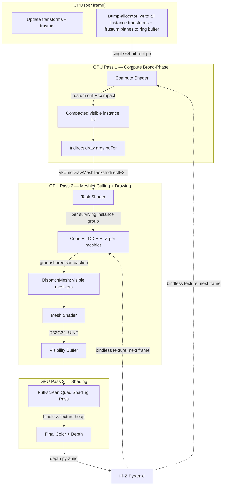

## GPU-Driven Meshlet Renderer: Implementation Roadmap

**Goal:** Render an arbitrary number of distinct meshes, each with many instances, in as few draw calls as possible.

**Culling model:** Two-tier, as used by production GPU-driven renderers (e.g. Ubisoft's clustered rendering, SIGGRAPH 2015). A compute shader does broad-phase instance-level culling and writes indirect draw arguments. The task/mesh pipeline is dispatched indirectly and does fine-grained per-meshlet culling (frustum, cone, Hi-Z, LOD) for surviving instances only. This separates the O(instances) work from the O(meshlets × visible_instances) work.

**Architectural philosophy:** Follow Sebastian Aaltonen's "No Graphics API" principles — treat GPU memory as a flat, pointer-addressable space with bindless textures, push data through a single 64-bit root pointer, and minimize PSO-baked state. Every binding API we can eliminate reduces both CPU overhead and code complexity.

---

### Phase 0 — Codebase Cleanup & Organisation

This phase is zero-cost functionally but pays off in every later phase. The priority is eliminating global mutable state, separating concerns, and making the codebase testable.

| # | Rationale |
|---|-----------|
| **0.1 — Remove package-level globals from `gfx`** | `view`, `projection`, `camera_origin`, and `model` are `package gfx` variables set from `main` before `draw_frame`. Replace them with a `FrameUniforms` struct passed explicitly into `record_command_buffer`. No more invisible coupling. |
| **0.2 — Extract `Renderer` infrastructure from scene data** | `Renderer` currently holds command pools, queues, descriptor sets *and* mesh buffers, instance buffers, scene data. Split into `Renderer` (Vulkan plumbing) and `Scene` (what gets drawn). The renderer receives a `^Scene` at draw time. |
| **0.3 — Move `model.odin` into its own package** | Model loading, meshlet cooking, and the `Vertex`/`Meshlet`/`Primitive` types all live in `package main`. Move them to a `model` or `assets` package so they're reusable and independently testable. |
| **0.4 — Split `renderer.odin` into focused files** | The file is ~920 lines and covers init, swapchain, sync objects, command recording, texture loading, immediate submit, and frame submission. Split into: `device.odin`, `swapchain.odin`, `sync.odin`, `commands.odin`, and keep `renderer.odin` as the high-level orchestrator. |
| **0.5 — Extract `main.odin` rendering setup into a dedicated procedure** | All model loading, buffer creation, instance population, and upload logic is inline in `main`. Pull it into `init_scene() -> Scene` so `main` is ~30 lines of: init, loop, shutdown. Makes it trivial to write a headless test harness. |
| **0.6 — Add logging channel / level control** | `ODIN_DEBUG` gates the tracking allocator and console logger, but there's no way to silence verbose Vulkan messages. Add a simple runtime log-level enum so tests don't flood stdout. |
| **0.7 — Write smoke tests for the build pipeline** | The `test/` directory is empty. At minimum: (a) load a known glTF and assert vertex/index/meshlet counts, (b) create buffers without a GPU window (headless VK instance), (c) validate `Scene_Data` layout matches the shader. These don't need a swapchain or a window. |
| **0.8 — Split the monolithic shader** | `test.slang` contains task, mesh, and fragment stages. Split into `tasks/meshlet_cull.slang`, `meshes/meshlet_draw.slang`, `fragments/forward.slang`. Add a `structs/meshlet_types.slang` shared header. Makes each stage testable in isolation and readable at a glance. |
| **0.9 — Add `Scene_Data` CPU/GPU layout validation tests** | The Odin `Scene_Data` struct and the HLSL `SceneData` struct must match exactly (alignment, field order, sizes). Add a compile-time or test-time assertion that validates `size_of` and field offsets match between CPU and GPU — a misalignment here silently corrupts rendering. |
| **0.10 — Introduce a `FrameContext` struct** | `Renderer` uses a bare `frame_index` and manually indexes `frames[frame_index]`. Wrap the per-frame resources (command buffer, semaphore, fence, and scene-data ring buffer) into a `FrameContext` that `draw_frame` receives, so the frame-cycling logic is self-contained. |
| **0.11 — Adopt a consistent naming convention for GPU types** | `Meshlet` (gfx package), `Vertex` (main package), `Vertex` (gfx package), `Instance` (main package), `Push_Constants` (gfx package) — these are scattered across packages with different naming styles. Gather all GPU-facing struct definitions into one place with a single convention (e.g. `GpuMeshlet`, `GpuVertex`, `GpuInstance`). |

---

### Phase 1 — Multi-Mesh Scene Graph

Before scaling instances, the renderer needs to know about *multiple meshes* — each with its own vertex/index/meshlet data and its own instance set. All geometry lives in a single unified GPU buffer (the megabuffer pattern).

| # | Rationale |
|---|-----------|
| **1.1 — Define a `Mesh` GPU-side handle** | Add a `Mesh` struct that references one contiguous range in the global vertex, index, and meshlet buffers. The 64-bit GPU address of each buffer + offset + count is stored. Each mesh also carries an aggregate bounding sphere for CPU-side broad-phase culling. |
| **1.2 — Extend `Instance` to reference a mesh** | Add a `mesh_index` field to `Instance`. The task shader uses it to look up the correct mesh's meshlet range, vertex base address, and index base address from a global mesh table. This is the key enabler for multi-mesh rendering. |
| **1.3 — Build a global meshlet table in `Scene`** | `Scene` collects all meshes, packs their vertex/index/meshlet data into shared GPU buffers, and builds a `MeshHandle[]` table + `Instance[]` buffer. One `vkCmdDrawMeshTasksEXT` dispatches *all* instances across *all* meshes. |
| **1.4 — Write the megabuffer upload path** | CPU-side: concatenate all mesh data into a staging buffer, then do one transfer to device-local GPU memory. The GPU sees one contiguous allocation. Mesh handles store 64-bit base addresses (pointer arithmetic, no `vk.Buffer` + offset pairs). |
| **1.5 — Test: N different meshes, each with M instances** | Load 3+ distinct `.glb` files (boulder, bunny, etc.), assign each 100–1000 instances, and verify all draw correctly in a single dispatch. This is the acceptance test for Phase 1. |

---

### Phase 2 — GPU Broad-Phase: Compute-Shader Instance Culling

The current renderer has no culling — every (instance, meshlet) pair runs through the task shader unconditionally. This phase adds a compute pass that does coarse instance-level culling and produces indirect draw arguments. The task shader only sees surviving instances.

| # | Rationale |
|---|-----------|
| **2.1 — Compute shader: frustum-cull instances, compact survivors** | Dispatch one thread per instance. Test each instance's bounding sphere against the 6 frustum planes. Use wave intrinsics + groupshared atomics to compact surviving instance indices into an output buffer. |
| **2.2 — Write indirect meshlet dispatch args from the compute shader** | The compute shader outputs an indirect dispatch buffer: for each surviving instance, the dispatch dimensions (`ceil(meshlet_count / 32)`, 1, 1) and the compacted instance index. Also output a global `drawCount` that feeds `vkCmdDrawMeshTasksIndirectEXT`. |
| **2.3 — Add a barrier with `HAZARD_DRAW_ARGUMENTS` semantics** | After the compute pass, insert a pipeline barrier that flushes the command processor's prefetched indirect arguments before the mesh pipeline reads them. Maps to `VK_PIPELINE_STAGE_2_DRAW_INDIRECT_BIT` in Vulkan. |
| **2.4 — Task shader: dispatch per-instance groups via indirect draw** | Replace `vkCmdDrawMeshTasksEXT(ceil(instances × meshlets / 32), 1, 1)` with `vkCmdDrawMeshTasksIndirectEXT` reading the compute-generated buffer. The task shader now receives exactly one group per surviving instance — no wasted dispatch slots for culled instances. |
| **2.5 — CPU-side instance broad-phase (optional fast path)** | For very large instance counts (10k+), also run a CPU frustum check before uploading instance transforms to the GPU. This pre-filters before the compute shader even runs and costs almost nothing. |

---

### Phase 3 — Memory Model: Toward "No Graphics API"

Following Aaltonen's principles, we progressively reduce API surface. Vulkan still sits underneath, but our *usage* of it should look as close as possible to the "single root pointer + bindless heap" model.

| # | Rationale |
|---|-----------|
| **3.1 — Bump-allocator for per-frame GPU uploads** | Implement a simple linear (bump) allocator that wraps a persistently-mapped host-visible buffer. Returns `{*cpu, gpu_address}` pairs. All per-frame data (uniforms, draw args, instance transforms) is written directly to GPU-visible memory. Replaces explicit `write_to_buffer` calls scatter throughout the code. |
| **3.2 — Collapse `Scene_Data` into the per-dispatch root pointer** | The current design has push constants carrying a `Scene_Data*`. This already follows the single-root-pointer pattern. Clean up the push constant struct to contain *only* the root data pointer — move `model_matrix` into the root data or into per-instance data so push constants are trivially one `u64`. |
| **3.3 — Ring-buffer `Scene_Data` per flight frame** | `Scene_Data` is CPU-written every frame and GPU-read in-flight. Triple-buffer it (one write slot per `FrameContext`) to eliminate the implicit CPU→GPU stall. Already partially set up — `MAX_FRAMES_IN_FLIGHT = 3` exists. |
| **3.4 — Move static geometry to device-local memory** | Vertex buffers, meshlet buffers, and index buffers are currently `HOST_ACCESS_SEQUENTIAL_WRITE` which forces them into host-visible (often system RAM) memory. Upload once via staging copy to `DEVICE_LOCAL` — this is a significant bandwidth win on discrete GPUs. |
| **3.5 — Instance buffer: ring-buffer with frame-indexed offset** | The instance transform buffer changes every frame. Write directly into a persistently mapped ring buffer at the per-frame offset. No `vkCmdCopyBuffer`, no staging — just a pointer write. |

---

### Phase 4 — Eliminate Descriptor Set Complexity

Aaltonen's key insight: on modern bindless hardware, there is no need for descriptor set layouts, descriptor pools, or per-pipeline binding declarations. The shader receives one 64-bit pointer and indexes everything from there.

| # | Rationale |
|---|-----------|
| **4.1 — Audit descriptor usage: what actually needs the bindless set?** | The current bindless set is used for buffers and sampled images, but mesh data is already passed via buffer device addresses (BDA). Texture descriptors could live in a BDA-referenced array instead. Identify what genuinely needs the descriptor set vs. what can be BDA. |
| **4.2 — Move to buffer device address for *all* buffer data** | Ensure every GPU buffer access goes through a 64-bit address stored in `Scene_Data`. No buffer descriptors in the bindless set for asset data. The bindless set shrinks to samplers + sampled images only. |
| **4.3 — Texture heap: allocate a contiguous descriptor array** | Reserve a range of texture descriptor slots as a "material texture heap." Each material stores a 32-bit base index into this heap. The fragment shader does `textureHeap[baseIndex + N]` to access albedo, normal, PBR textures. This is the SM 6.6 / VK_EXT_descriptor_buffer model. |
| **4.4 — Remove per-pipeline descriptor set layout variation** | All pipelines in the renderer should share one descriptor set layout (bindless samplers + bindless texture heap). No per-material or per-pass layout differences. Simplifies pipeline creation and eliminates layout compatibility checks. |

---

### Phase 5 — Asset Pipeline & LOD Cooking

| # | Rationale |
|---|-----------|
| **5.1 — Offline meshlet cooking** | Build meshlets with meshoptimizer off the critical path and serialize to a binary format. Loading becomes a direct GPU upload instead of glTF→meshopt conversion at startup. Use a simple flat binary: header → vertices → indices → meshlet array → LOD metadata. |
| **5.2 — LOD meshlet sets** | For each mesh, cook 2–3 LOD levels with decreasing meshlet count. Store per-LOD meshlet ranges in the mesh metadata. The task shader selects the LOD range to iterate based on projected instance size (from 2.3). |
| **5.3 — Binary asset format with version tag** | The cooked format needs a magic number + version to detect mismatches. Regenerate automatically if the source `.glb` is newer than the cooked file. |
| **5.4 — Material system with bindless textures** | Add a `Material` GPU struct (albedo texture index, normal index, PBR params). Each meshlet references a material ID. The forward shader samples bindless textures by index. Already partially wired (bindless descriptors exist, one texture uploaded) — needs to scale to N materials driven by a GPU material buffer. |

---

### Phase 6 — Visibility Buffer & Deferred Shading

| # | Rationale |
|---|-----------|
| **6.1 — Visibility buffer pass** | Instead of outputting vertex color in the mesh shader, write material-ID + triangle-ID + barycentrics to a visibility buffer (R32_UINT or R32G32_UINT attachment). |
| **6.2 — Full-screen shading pass** | Compute final pixel color in a second pass by reading the visibility buffer, unpacking barycentrics, interpolating vertex attributes, and sampling bindless material textures. Decouples shading cost from geometry complexity. |
| **6.3 — G-buffer fallback** | Add a G-buffer variant (albedo, normal, metal/rough) for a deferred path. The visibility-buffer approach is more GPU-driven-friendly, but supporting both lets us measure the trade-off. |

---

### Phase 7 — Fine-Grained Task Shader Culling

These culling techniques run *inside the task shader*, per meshlet, for instances that survived the compute broad-phase. Each operates on individual meshlets — frustum refinement, cone tests, Hi-Z occlusion — and gates whether a meshlet is emitted via `DispatchMesh`.

| # | Rationale |
|---|-----------|
| **7.1 — Robust frustum culling with non-uniform scale** | The current `max(max(length(...)))` scale hack is wrong for non-uniform transforms. Compute per-axis scale from the model matrix columns and apply it to the bounding sphere's oriented extent. |
| **7.2 — Backface cone culling** | meshoptimizer provides cone data (`cone_apex`, `cone_axis`, `cone_cutoff`) already stored in `Meshlet`. Add a cone-vs-camera test in the task shader after frustum culling — skip meshlets facing away from the camera. |
| **7.3 — Hi-Z occlusion culling** | Build a depth pyramid from the previous frame's depth buffer. Pass it as a bindless texture into the task shader. After frustum culling, do a mip-level depth test against the meshlet's projected bounding sphere. Feedback loop: t-1 depth → t occlusion. |
| **7.4 — Two-pass occlusion (optional)** | For scenes with high depth complexity, do a lightweight first pass that only writes depth, build Hi-Z from it, then do the full visibility-buffer pass with Hi-Z active. |

---

### Phase 8 — Profiling, Debugging & Developer Tooling

| # | Rationale |
|---|-----------|
| **8.1 — GPU timestamps** | Insert `VK_QUERY_TYPE_TIMESTAMP` around the task shader dispatch and the mesh shader execution. Report task cull time, mesh draw time, and fragment time in a HUD. |
| **8.2 — CPU profiling (Tracy or custom)** | Instrument Odin code with scoped profiling zones — `init_scene`, `upload_instances`, `record_command_buffer`, `submit_frame`. |
| **8.3 — Debug UI overlay (ImGui or custom)** | Show FPS, frame time, dispatch count, meshlets culled vs. total, GPU timestamps. Pause/resume frustum update (the F5 freeze already exists — extend it). |
| **8.4 — Wireframe / meshlet debug view** | Render meshlet boundaries color-coded by LOD level or cull status. Invaluable for debugging culling and LOD selection. |

---

### Phase 9 — Advanced GPU-Driven Patterns (Stretch)

| # | Rationale |
|---|-----------|
| **9.1 — Nanite-style software rasterization** | For sub-pixel triangles where the mesh shader rasterizer is wasteful, implement a software rasterization path in the mesh shader. Ambitious, but the architecture supports it. |
| **9.2 — GPU-managed LOD streaming** | Stream lower-LOD meshlets in/out based on camera distance using a GPU page table. Enables truly unbounded scene complexity. |
| **9.3 — Multi-viewport / cascaded shadow culling** | Reuse the same task shader dispatch for cascaded shadow maps or VR by testing meshlets against multiple frustums simultaneously before compaction. |

---

### Key Architectural Principles

1. **One 64-bit root pointer per dispatch.** The shader receives a single GPU address. Everything — frustum planes, mesh handles, instance transforms, texture heap base — is reachable by pointer-chasing from that root. No per-draw descriptor set binding.
2. **Two-tier GPU culling.** A compute shader does broad-phase instance-level culling (frustum, Hi-Z) and writes indirect draw arguments. The task shader does fine-grained per-meshlet culling (cone, LOD, detailed frustum) for surviving instances only. Separation of concerns at the natural O(instances) / O(meshlets) boundary.
3. **Indirect dispatch for mesh shading.** `vkCmdDrawMeshTasksIndirectEXT` reads draw arguments generated by the compute pass. Only surviving instances spawn task groups. No wasted dispatch slots.
4. **The CPU never touches per-meshlet data per frame.** It writes instance transforms and camera state into a ring-buffered bump allocator; everything else is persistent GPU memory.
5. **Static geometry is device-local.** Upload once via staging, never touch again. Only per-frame dynamic data lives in host-visible memory.
6. **Bindless textures via a global descriptor heap.** 32-bit indices stored in material structs. The fragment shader indexes into a contiguous descriptor array. No per-material descriptor set updates.
7. **PSO-baked state is minimal.** Raster desc (color/depth formats, topology, cull mode) goes into the pipeline. Depth-stencil, blend, and viewport/scissor are dynamic state separate from the PSO. Shader root data layout is *not* part of the PSO at all.

